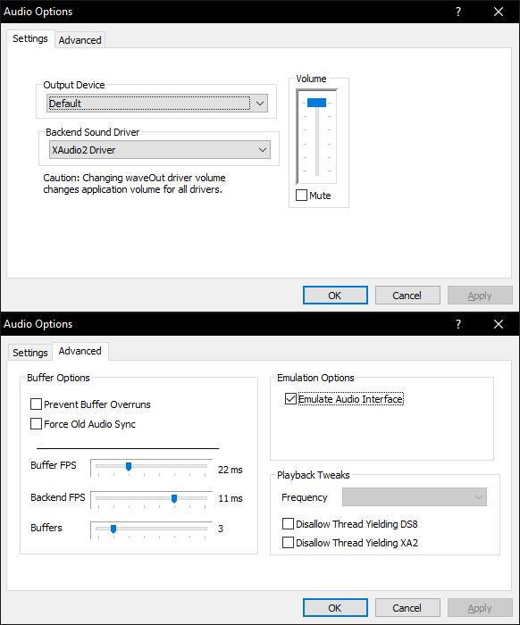

# Azimer’s HLE v0.70 WIP 10

[!file Descargar](https://www.mediafire.com/file/s1fil36hivy7qbj/AziAudio.dll/file)

El mejor plugin de audio disponible para Project64. Este en especifico es una version modificada que viene con mejores configuraciones default y el cual guarda la configuracion en AppData.

[!ref Regresa a la seleccion de plugins](plugin_setup.md#plugin-selection)
