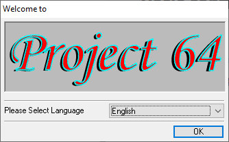
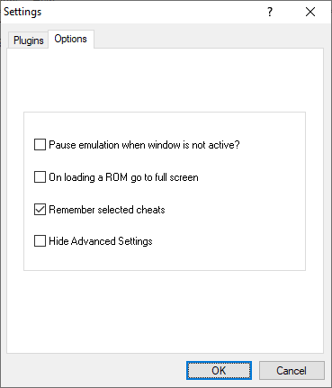
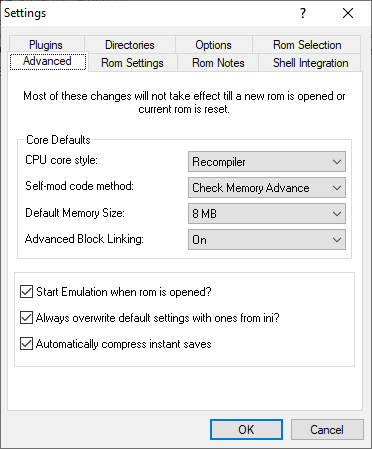
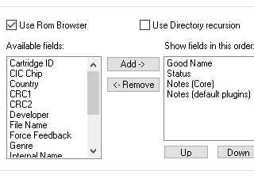
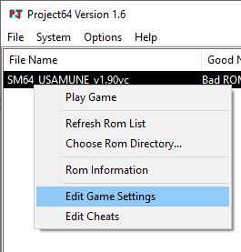
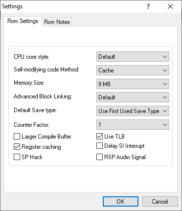

# Configuración basica
Al abrir el emulador por primera vez, se te dara la bienvenida con una ventana con un menú desplegable de selección de lenguaje. Se sugiere mantenerlo en **Ingles**, debido a que te sera mas fácil seguir la guía.

Luego de eso, la aplicación principal aparecerá, la cual contiene el navegador de ROM y una barra de menú. Si tienes una carpeta con tus juegos de N64, puedes seleccionarla yendo a **File -> Choose Rom Directory**. Despues debes hacer clic en **Options -> Settings**, luego haz clic en la pestaña **Options** y desmarca la casilla **Hide Advanced Settings**. No es estrictamente necesario, pero se sugiere desmarcar **Pause emulation when window is not active** y marcar **Remember selected cheats**, si planeas usar códigos para practicar u otras razones varias.

Luego, presiona OK y selecciona la ventana de **Settings** nuevamente. Nuevas pestañas deberían aparecer ahora. Primero, anda a la pestaña de **Advanced**. Las configuraciones aquí van a aplicar a todos las ROMs. Cambia **Default Memory Size** a **8 MB** como se muestra. Muchas romhacks, incluyendo Usamune (ROM de practica) y algunos códigos de practica de Gameshark requieren memoria adicional para funcionar correctamente.

#### Arreglar "Bad ROM?" 

Si planeas usar el navegador ROM integrado de Project 64, se sugiere encarecidamente cambiar algunas de las opciones para hacerlo más usable. Haz clic en la pestaña de **Rom Selection**. Aqui tu cambiaras las columnas visibles entre otras cosas. Por defecto, Project64 solo muestra un "Good Name" de un rom, el cual es sacado de la base de datos del emulador. Esto resulta en muchos romhacks llamandose **Bad ROM**, los cuales no son muy útiles, especialmente si tienes muchos ROMs de este estilo. Para arreglar esto, añade otro campo, como **File Name**.

#### Configuración de cada ROM 
Los contenidos de esta pestaña van a estar totalmente en gris si accedes sin abrir un ROM. Para editar los contenidos, abre un rom y accede a **Settings** nuevamente, o **haz clic derecho a un ROM** en el navegador y haz clic en **Edit Game Settings** en el menú contextual, como se ve abajo.

Asegurate que **Memory Size** este en **8 MB** (esto no debería ser necesario si has seguido los pasos previos) y **Counter Factor** este en **1**, lo cual removerá el lag presente en el juego, el cual es más visible cerca del submarino en DDD.
Ten en consideración que las versiones estándar del ROM de practica de Usamune (Japones o USA) también requerirán **CPU core style** en **Interpreter**. Lamentablemente esta opción es mucho más exigente en CPU, por lo que si tu computador es un poco lento, se sugiere mantenerlo en **Recompiler** y usar la **versión VC de Usamune**.

!!!
Dado que las configuraciones son aplicadas a cada ROM por separado, necesitaras cambiar las configuraciones de cada ROM que quieras correr.
!!!

