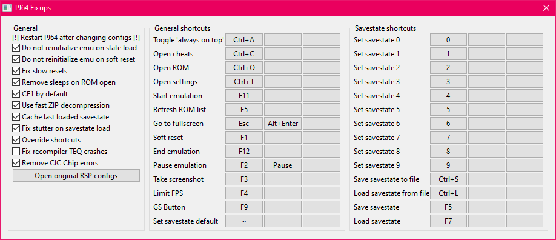

# PJ64 Fixups

[!ref target="blank" text="Descarga"](https://github.com/aglab2/PJ64Fixups/releases)

Este es un plugin RSP hecho por aglab2, el cual arregla muchos de los problemas presentes en Project 64 1.6, incluyendo varias características adicionales.
Lista no exhaustiva de cambios:
- Reinicios lentos mejorados
- Cargas de ROM instantáneas
- Counter Factor en 1 por defecto
- Algoritmos de descompresión ZIP más rapidos para mejores load states
- Último save state cargado en caché para cargas de load states más rápidas
- Solucionadas las pequeñas pausas luego de cargar un savestate
- Capacidad para reemplazar cualquier atajo de teclado del emulador
- Solucionado el TEQ crash
- Removido el error de chip CIC
- Mejorado el rendimiento de la reinicialización en resets/save states

Cuando esté configurado correctamente el título de la aplicación deberia aparecer como **LINK's Project64**.

[!ref Regresar a la selección de plugins](plugin_setup.md#selección-de-plugins)