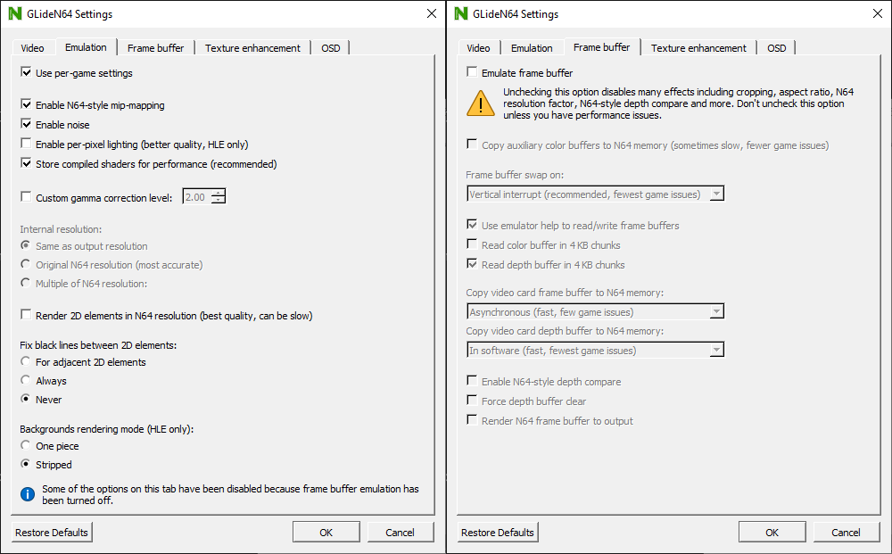

# ANGLE GLideN64 (LINK's GLideN64)

[!ref target="blank" text="Descarga"](https://github.com/aglab2/GLideN64/releases)
[!file Descarga (version antigua)](https://www.mediafire.com/file/k9ad2bdodde327u/GLideN64-sm64hacks.zip/file)

Posiblemente el mejor HLE graphic plugin disponible. Este es un fork de GLideN64, introduciendo algunas regresiones para mejorar compatibilidad de romhacks. Esta version del plugin tambien permite correciones de relacion de aspecto con framebuffer desactivado. Resolucion 720p es recomendada para evitar artefactos visuales causados por el framebuffer. La version ANGLE tambien introduce DX11 y Vulkan backends, mientras mantiene la version de legado de OpenGL backend como una opcion.

!!!Advertencia
Asegurate de **desactivar** "framebuffer emulation", debido a que incrementa la latencia.
!!!

!!!Advertencia
Si usas OBS, asegurate de usar **Game Capture** o **Captura de Juego**.
!!!

[!ref Regresar a la selección de plugins](plugin_setup.md#selección-de-plugins)
