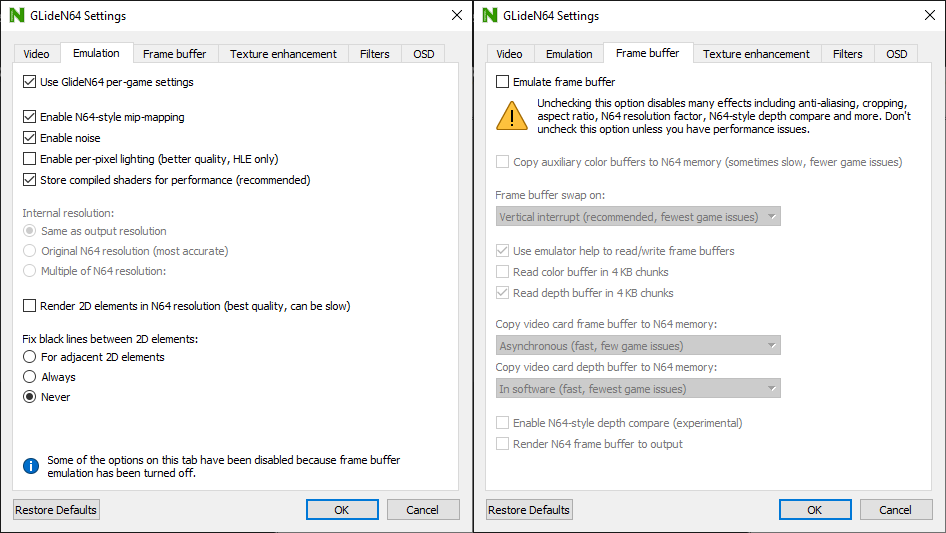

# GlideN64 rev. 8004dc2

[!file Descarga](https://www.dropbox.com/s/wilxwf4kwan60sy/GLideN64%20rev8004dc2.zip?dl=1)

Una versión mas antigua de GLideN64. Comparada a la versión nueva, le faltan algunas características (tales como relación de aspecto con framebuffer desactivado), de todas maneras tiene buena compatibilidad con romhacks y es menos exigente en recursos. Resolución 720p es recomendada para evitar artefactos visuales casuados por framebuffer.

!!!warning
Asegurate de **desactivar** "framebuffer emulation", debido a que incrementa la latencia.
!!!

!!!warning
Si usas OBS, asegurate de usar **Game Capture** o **Captura de Juego**.
!!!

[!ref Regresar a la selección de plugins](plugin_setup.md#selección-de-plugins)
