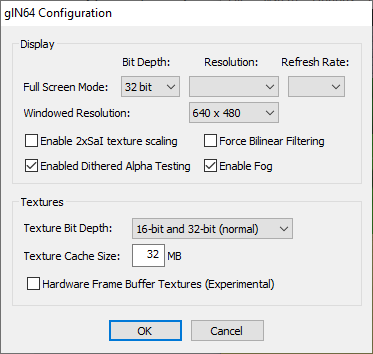

# glN64 0.4.1

[!file Descarga](https://www.dropbox.com/s/a15svm4daaqe51g/glN64_v0.4.1.zip?dl=1)

Una version anterior del plugin con bajos requirimientos que aun funciona bien para Super Mario 64. Usa esto si tienes un PC muy antiguo y GLideN64 no te funciona.
!!!
Asegurate de marcar **Enabled Dithered Alpha Testing** para arreglar el efecto presente al aparecer en warps o con Vanish Cap.
!!!

[!ref Regresar a la selección de plugins](plugin_setup.md#selección-de-plugins)
