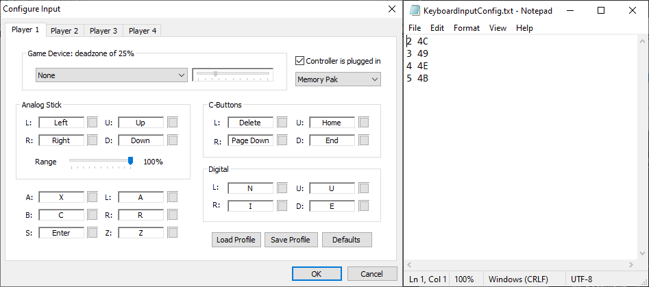

# LINK's DirectInput7 1.6.1

[!file Descarga](https://www.mediafire.com/file/vtr2wup8d9l664l/KeyboardInput.zip/file)

Este plugin es una modificación de Jabo's DirectInput hecho para jugadores de **teclado**, el cuál añade soporte para modificadores análogos (para que por ejemplo puedas caminar en vez de correr). Los modificadores son configurados a partir del archivo de texto **KeyboardInputConfig.txt**, el cuál especifica la **cantidad por la cuál el valor analogico es dividido** junto a **virtual-key codes**, los cuales especifican que botones activan estos modificadores.

!!!
Una lista completa de las **virtual-key codes** pueden ser encontradas acá: [https://docs.microsoft.com/en-gb/windows/win32/inputdev/virtual-key-codes](https://docs.microsoft.com/en-gb/windows/win32/inputdev/virtual-key-codes)
!!!

Por ejemplo, la primera línea del archivo pretederminado es `2 4C`, el cuál significa que el valor del análogo sera dividido por **2** cuando la tecla L sea presionada. El plugin leerá **sólo 5 líneas** de la configuración, por lo que es probable que tengas que reemplazar configuraciones existentes dependiendo de tus necesidades.

Un video explicativo complementario en inglés puede ser encontrado aquí:

[!embed](https://www.youtube.com/embed/pwsz8ak65N0?start=142)

[!ref Regresar a la selección de plugins](plugin_setup.md#selección-de-plugins)
