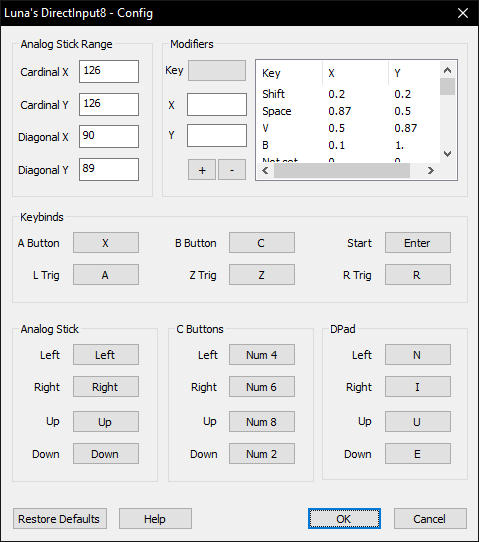

# Luna's DirectInput8

[!ref target="blank" text="Descarga"](https://github.com/LunaticShiN3/Luna-DirectInput8/releases)

!!!
Este plugin solo funciona en teclado. Para controles, usa una alternativa apropiada listada en la [pagina de selección de plugins](plugin_setup.md#selección-de-plugins).
!!!

!!!
Instrucciones de uso detallado de este plugin se pueden encontrar en la pagina de la autora (en ingles): [https://sites.google.com/view/shurislibrary/luna-dinput8](https://sites.google.com/view/shurislibrary/luna-dinput8)
!!!

Este es un plugin diseñado para jugadores de **teclado**, hecho para solucionar problemas de otros plugins. Tiene una interfaz gráfica para poder cambiar mapeo de teclas con un modificador flexible de valores analogos (lo cual te permite por ejemplo caminar en vez de correr, o sostener un ángulo especifico de manera consistente).

[!ref Regresar a la selección de plugins](plugin_setup.md#selección-de-plugins)
