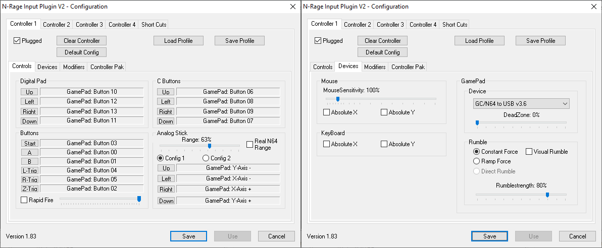
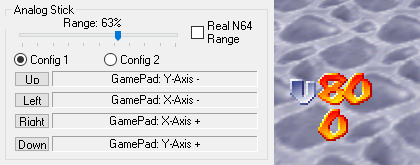
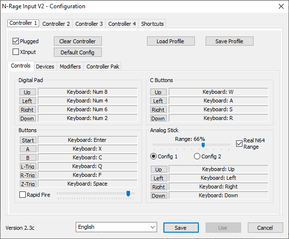

# N-Rage's Direct-Input8 V2 1.83

[!file Descarga](https://www.dropbox.com/s/31fdrxuxjybzzu0/nrplugin2_183.zip?dl=1)

!!!
Antes de intentar configurar los controles, ve a la pestaña **Devices** y selecciona tu controlador en el menú desplegable de dispositivos.
!!!

Un plugin más antiguo con una gran cantidad de características. Una excelente opción para controladores DirectInput, pero puede tener problemas al usar XInput. Asegúrate de que **Plugged** esté marcado. Ajusta la deadzone al menor valor que no te cause problemas (por ejemplo, Mario caminando solo), generalmente el 0% es suficiente ya que SM64 tiene su propia deadzone (zona donde el análogo no mueve a mario).

### Eligiendo el rango
Para determinar el rango óptimo del análogo, es posible usar la ROM Usamune para visualizar el valor numerico de nuestro análogo. Para habilitarla, inicia la ROM, luego presiona direccional para abajo, para abrir el menú de configuración. Navega hasta la sección HUD, luego establece la opción INPUT en ONVAL usando los botones C. Esto debería hacer que aparezcan dos números en la esquina inferior izquierda del juego, el primero siendo el valor del eje Y y el otro el eje X. Ajusta el rango en la configuración de N-Rage hasta que alcances aproximadamente 80 en el juego mientras mantienes las direcciones principales. Esto es similar al rango del mando original de N64 y lo normal para los juegos de N64, cualquier cosa más resultará en una sensibilidad excesiva. Si tienes problemas para alcanzar esos valores incluso con el rango establecido al 100%, intenta calibrar tu mando en Windows.

!!!warning
La opcion **Real N64 Range** debe estar **sin marcar** siempre, ya que reduce el rango en los ángulos diagonales.
!!!

## N-Rage Input Plugin V2 2.4(fork)

[!file Descarga](https://malkierian.com/downloads/NRage-Xinput.zip)

Uso similar al de las versiones antiguas. Usa esto si tienes problemas con 1.83.

El paquete de instalación manual debería también incluir Xidi, el cual ayuda a tener compatibilidad con mandos XInput.

!!!warning
Evita usar el XInput mode - su código está adherido arriba del resto del plugin, lo cual provoca problemas como por ejemplo macros no funcionando. Ademas no maneja reconexión de mandos de manera correcta y el rango del análogo es muy sensitivo. Si quieres usar un XInput controller, [**Octomino's SDL Input**](octomino.md) puede ser usado como mejor alternativa.
!!!

[!ref Regresar a la selección de plugins](plugin_setup.md#selección-de-plugins)
