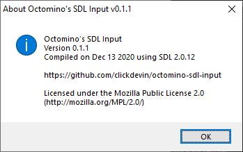
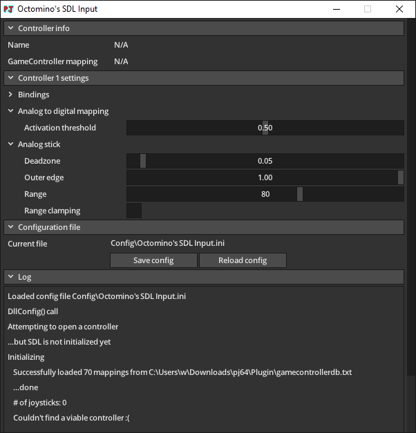

# Octomino's SDL Input v0.1.1

[!file Descargar](https://github.com/clickdevin/octomino-sdl-input/releases/download/v0.1.1/octomino-sdl-input-0.1.1.zip)

Un plugin basado en la libreria SDL2. Contiene soporte para controles tales como Xbox, PS4/5, Switch Pro y muchos otros proporcionados por [base de datos de controles](https://github.com/gabomdq/SDL_GameControllerDB). Plug and play, no es necesario configurar.

## Fork de wermi

[!ref target="blank" text="Download"](https://github.com/wermipls/octomino-sdl-input/releases)

Si bien el proyecto original no tiene configuraciones y no ha sido actualizado en un tiempo, existe un fork el cual entrega soporte para configuraciones de manera rudimentaria. Usa esto si no estas satisfecho con las configuraciones originales.

!!!warning
El plugin aun esta en progreso y puede tener bugs.
!!!

[!ref Regresar a la selección de plugins](plugin_setup.md#selección-de-plugins)
