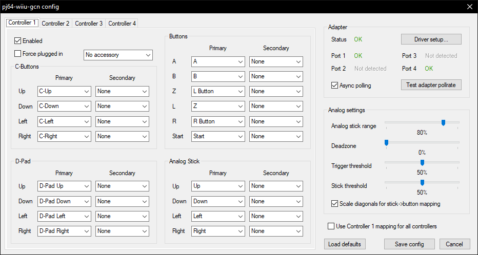
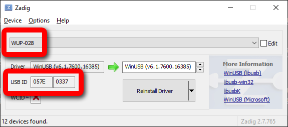

# pj64-wiiu-gcn

[!ref target="blank" text="Descarga"](https://github.com/wermipls/pj64-wiiu-gcn/releases/latest/download/pj64-wiiu-gcn.dll)

Input plugin con soporte nativo para el adaptador de Wii U/Switch Gamecube (y clones en modo Wii U). Recuerda asegurar que ningún programa usando el adaptador (tales como Dolphin, Yuzu o GCNUSBFeeder) esté abierto. Antes de abrir el emulador, asegúrate que el mando esté conectado en el **primer puerto** del adaptador. Si no has instalado el **WinUSB driver** a través de **Zadig** todavía, lee la siguiente sección.

## WinUSB driver install

Antes de usar el plugin, necesitarás tener el driver WinUSB instalado. Para hacer eso, Descarga y corre Zadig de su página oficial:

[!ref target="blank" text="Zadig (página oficial)"](http://zadig.akeo.ie/)

Luego de abrir el instalador, deberias tener una ventana similar a la de imagen de abajo. Haz clic en **Options** y marca **List All Devices**. En el menú desplegable, selecciona **WUP-028**.

!!!danger
¡**NO** intentes instalar el driver si el dispositivo no es el mismo! El campo de **USB ID** debe ser `057E 0337`, como la imagen de abajo. Si tienes un adaptador genérico asegúrate que el modo Wii U esté seleccionado.
!!!

[!ref Regresar a la selección de plugins](plugin_setup.md#selección-de-plugins)
