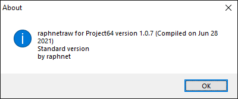

# raphnetraw for Project64

[!file Descarga](https://www.raphnet.net/programmation/mupen64plus-input-raphnetraw/pj64raphnetraw-1.0.7.zip)

Un plugin para adaptadores de **tercera generacion raphnet N64 to USB**, permite comunicación directa con el mando. Tiene baja latencia y provee un 100% de precision en inputs a la consola. No necesita configuracion.

!!!
Se sugiere usar el **puerto 1 solamente** para rendimiento optimo.
!!!

!!!
Si tienes puerto dual en tu adaptador, existe un fork que hace posible cambiar entre mandos de N64 presionando Z+L+R: https://github.com/panther03/pj64raphnetraw/releases 
!!!

[!ref Regresar a la selección de plugins](plugin_setup.md#selección-de-plugins)
