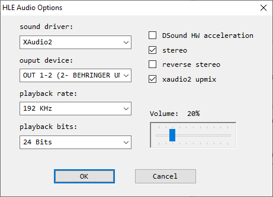

# Plugin de audio shunyuan’s HLE v1.8.2u1

[!file Descarga](https://www.dropbox.com/s/hhgnnm77a3945j7/HleAudio_v1.8.2u1.zip?dl=1)

Otro buen plugin de audio, pese a eso, tiene mayor latencia que el plugin Azimer, y no permite ir mas alla del limite de FPS.

!!!Precaución

Este plugin **NO** esta recomendado para speedrun.

Este plugin no limita FPS durante escenas de carga, dando una ventaja injusta cuando **Frame Limiter** esta desactivado. Esto es muy facil de cometer por completo accidente, y dicho caso resultara en una run **INVALIDA**.

!!!

[!ref Regresar a la selección de plugins](plugin_setup.md#selección-de-plugins)
