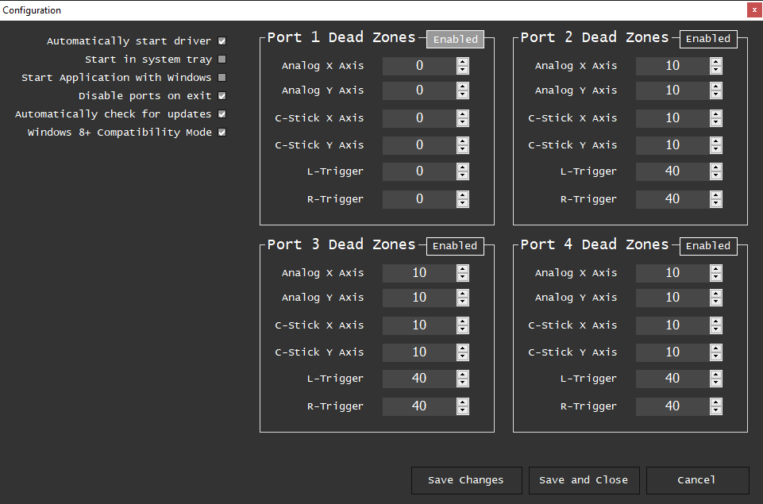

# Configuración de adaptador de mando de Gamecube para Wii U/Switch

Para este adaptador, hay dos opciones para usarlo. Puedes usar un plugin que dé soporte al adaptador nativamente (Parecido a Yuzu o Dolphin) o puedes usar el driver de Massive en conjunto con N-Rage.

!!!warning Antes de que sigas
Si tienes un adaptador genérico, podrías querer **evitar esta parte de la guía completamente**, y en vez usar el modo PC de tu adaptador con el [**N-Rage's Input**](nrage.md). Esto sería más facíl de configurar y utilizar, también funciona relativamente igual.

Adicionalmente, [algunos adaptadores (tienen un boton en vez de un switch) aparentemente **no pueden ser cambiados a modo Wii U**](https://forums.dolphin-emu.org/Thread-cannot-switch-compatible-gamecube-adapter-to-wiiu-switch-mode), lo cuál es estrictamente necesario para que funcione.
!!!
## Plugin de input nativa

Para instrucciones detalladas, revisa la página de esta guía dedicada a este plugin.

[!ref pj64-wiiu-gcn](pj64-wiiu-gcn.md)
## Driver de Massive

Si quieres usar el adaptador con otros plugins, es necesario instalar los drivers que harán que el mando funcione como DirectInput.
!!!warning
Hay reportes de drivers con problemas para algunos adaptadores genéricos. Si no tienes el adaptador oficial de Nintendo o el de Mayflash, ten cuidado :scream:.
!!!

!!!warning
Si usas **Windows 11**, es posible que no seas capaz de instalar vJoy. Revisa https://github.com/shauleiz/vJoy/issues/57 para revisar detalles.
!!!

### Instalando los drivers de Massive 
Instrucciones detalladas del proceso de instalación se pueden encontrar abajo.

[!ref target="blank" text="Página de Massive en ingles"](http://m4sv.com/page/wii-u-gcn-usb-driver)

### Configuraciones de drivers adicionales

Después de instalar los drivers, es una buena idea cambiar un par de configuraciones. En la aplicación del adaptador, haz clic en **Configurar**. Por defecto, los cuatro puertos están habilitados; puede que quieras **desactivar** los que no estés usando para evitar llenar tu lista de dispositivos. Ajusta las **deadzone del análogo** a 0 (podrás ajustar la deadzone en Project64 más adelante). Marca la opción **Disable ports on exit** para deshabilitar los dispositivos vJoy después de terminar de usar los controladores. Una vez que hayas terminado, haz clic en **Save and Close**.

### Calibración de mando
Algunos mandos de Gamecube tienen una posición neutral del análogo incorrecta de fábrica. Desafortunadamente, los drivers de Massive no calibran los centros de los análogos, como lo haría una consola real. Para compensar esto, puedes calibrar el mando en Windows. En la ventana del adaptador, haz clic en **Información sobre el gamepad de Windows** o **Windows Gamepad Info**, luego haz doble clic en Dispositivo vJoy. Ve a la pestaña **Settings o Configuración** y haz clic en el botón **Calibrar**. Sigue las instrucciones en el asistente de calibración. Después de terminar, tu análogo debería estar correctamente centrado.

Puedes encontrar información adicional sobre cómo usar N-Rage en la página dedicada a este plugin en la guía, enlazada abajo.

[!ref Plugin de mando N-Rage's](nrage.md)
